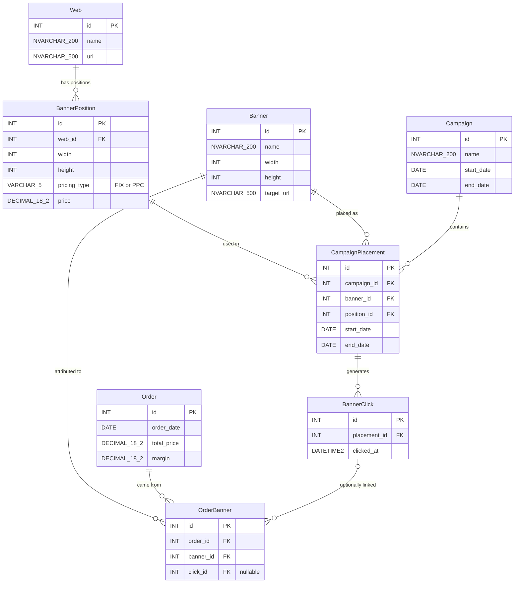

# Banner Campaign Tracking — Entity Relationship Diagram

## Relationship Summary

| Relationship | Cardinality | Description |
|---|---|---|
| Web -> BannerPosition | 1:N | Each website contains multiple banner positions/slots |
| Campaign -> CampaignPlacement | 1:N | A campaign contains multiple banner placements |
| Banner -> CampaignPlacement | 1:N | A banner creative can be placed in multiple positions/campaigns |
| BannerPosition -> CampaignPlacement | 1:N | A position slot can host different banners over time |
| CampaignPlacement -> BannerClick | 1:N | Placements record individual user click events |
| Order ↔ Banner (via OrderBanner) | M:N | An order can be attributed to one or more banners |
| OrderBanner -> BannerClick | N:1 (optional) | Optional link to trace attribution to a specific click event |
